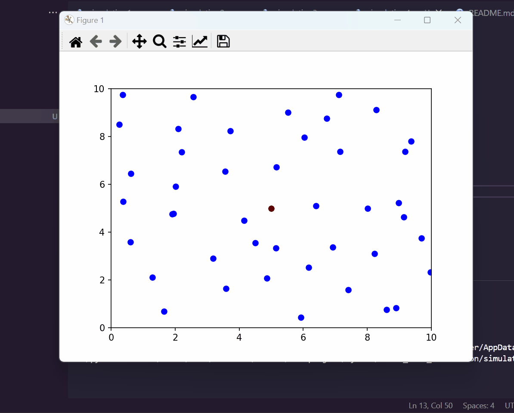

Crowd move simulation

## Simulation 1

## Simulation 2 (obstacle avoidance and goal-seeking)
- Agents avoid obstacles in their path.
- Agents have different types of goals (e.g., avoiding certain areas, seeking specific locations).

## Simulation 3 (dynamic destinations for agents)
destinations for agents are updated every 100 steps

## Simulation 4 (collision avoiding with other agents)

